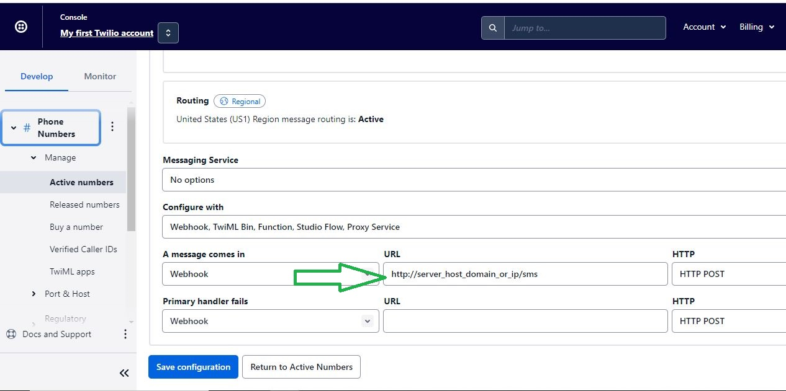

# twilio-receive-message-hooks

# twilio-receive-otp

This is project to handle otp authentication for web scraping projects where websites require authentication for login.
  

Clone on server  

Edit index.js on "const from_number = '';" if you know. If don't when you recieve first otp you will know
  

npm install 
npm start  

Configure Twilio number like below  

</img>
